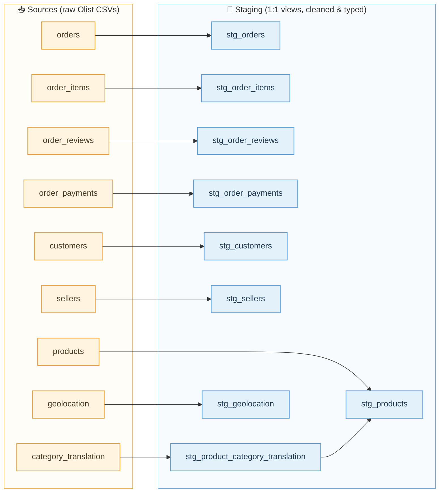
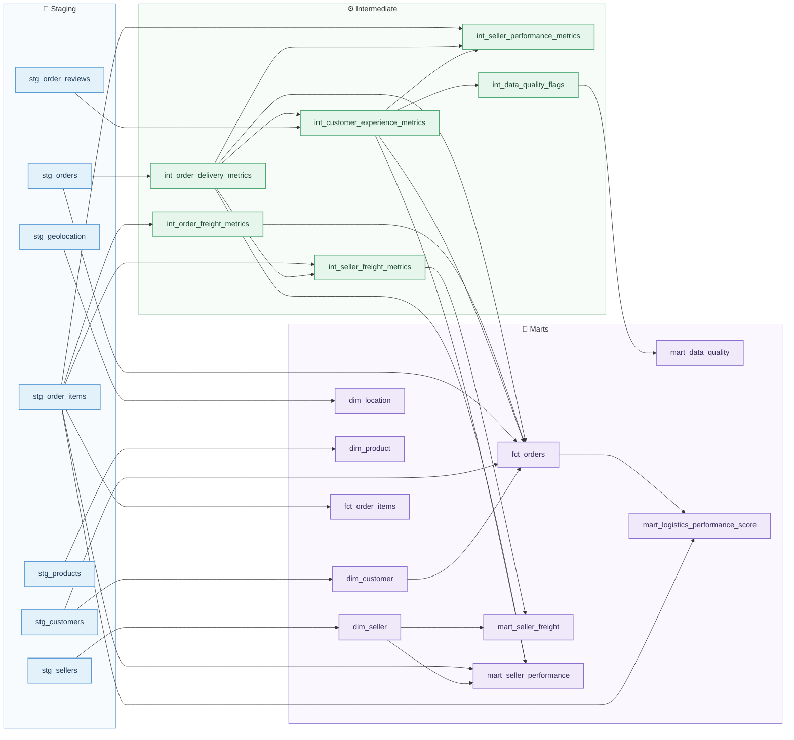
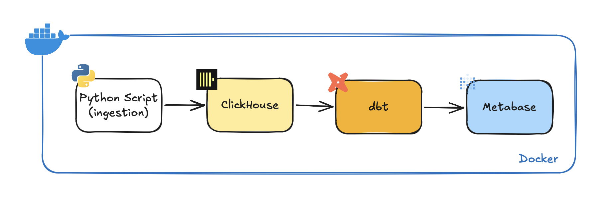
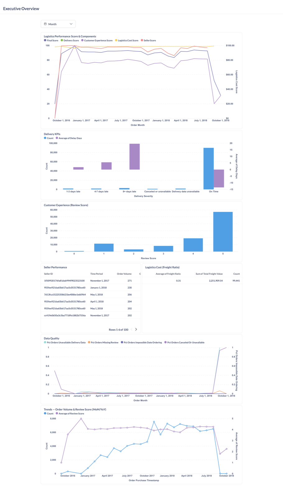
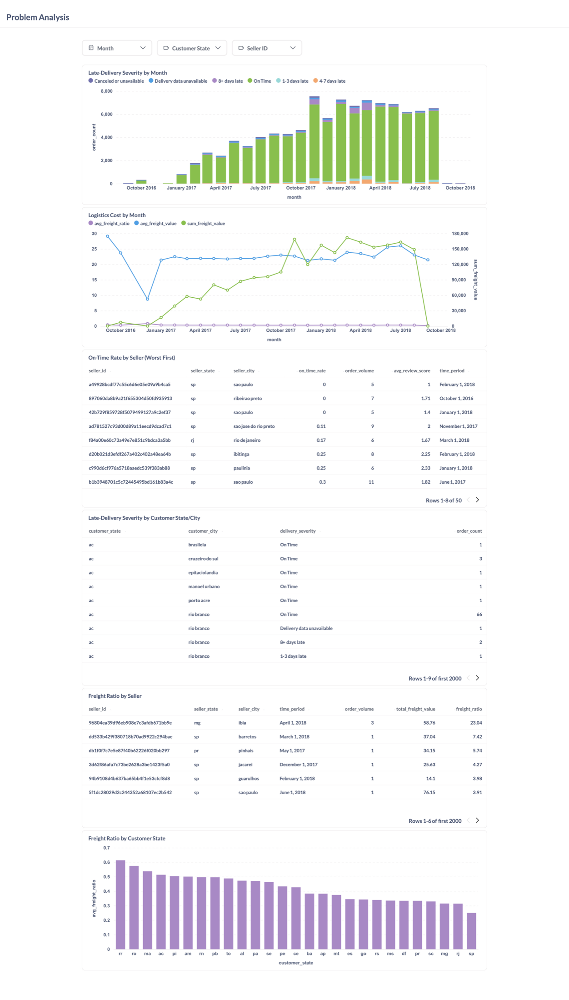
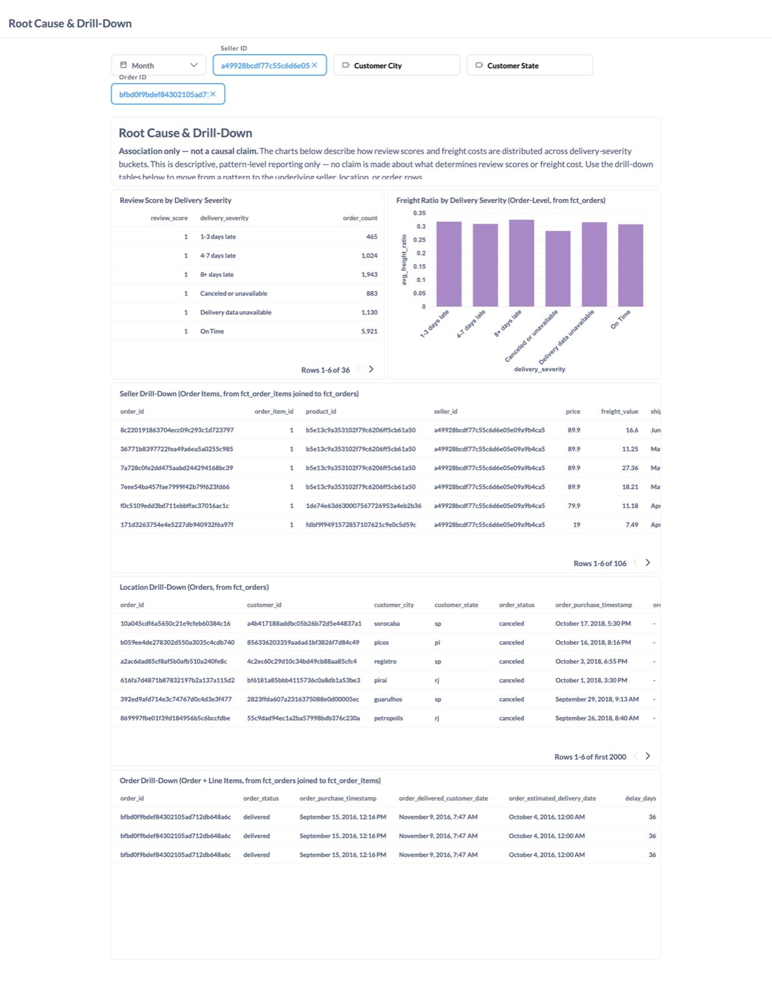

# E-Commerce Logistics Analytics

[](https://clickhouse.com/)
[](https://www.getdbt.com/)
[](https://www.metabase.com/)
[](https://www.docker.com/)
[](https://www.python.org/)
[](https://docs.astral.sh/uv/)

## Objective

This project builds an analytics-engineering pipeline for the **Olist Brazilian E-Commerce Public Dataset** (100k+ orders, 2016-2018), focused on logistics performance: delivery speed, freight cost, seller performance, customer experience, and data quality. It uses **ClickHouse, dbt, and Metabase**, all running locally via Docker.

You can check the source of data here: [https://www.kaggle.com/datasets/olistbr/brazilian-ecommerce](https://www.kaggle.com/datasets/olistbr/brazilian-ecommerce)

### At a Glance

| Metric | Value |
| --- | --- |
| Orders analyzed | 99,441 (Sep 2016 – Oct 2018) |
| Order line items / GMV | 112,650 items / ~R$15.8M |
| Sellers tracked | 3,095 |
| dbt models | 26 (9 staging → 6 intermediate → 11 marts) |
| dbt tests | generic (`unique`/`not_null`/`relationships`/`accepted_values`) + custom business-rule tests |
| Dashboards | 3 analysis dashboards + 1 home/navigation dashboard, all Metabase-native on top of marts |

---

## 💭 Problem Statement

The main business question is:

> **How is our logistics operation performing, where are the problems, and why are those problems happening?**

The analytical flow is:

```text
How are we doing?
        ↓
Where are the problems?
        ↓
Why are we seeing them?
```

The intended users are:

- Management / executives
- E-commerce operations
- Logistics operations

### Key Insights:

1. **Delivery Performance**:
   - Classify orders as on time, 1–3 days late, 4–7 days late, or 8+ days late against the estimated delivery date.
   - Orders without usable delivery dates are flagged as "delivery data unavailable" rather than assumed late.

2. **Logistics Cost**:
   - Analyze freight value relative to order value across sellers, geography, and time.

3. **Seller Performance**:
   - Track on-time delivery rate and order volume per seller to identify strong and weak performers.

4. **Customer Experience**:
   - Compare review scores across delivery-severity groups to see whether delays are associated with lower ratings (correlation, not causation).

5. **Data Quality**:
   - Surface missing/unusable delivery dates and other data-quality gaps as their own metric, kept separate from the logistics performance score.

---

## 🚀 Pipeline Overview

1. **Data Ingestion**
   - Load the 9 Olist CSVs verbatim into ClickHouse's `raw` database using `scripts/load_raw.sh` (no renaming/transformation/dedup at this stage).

2. **Staging (`dbt/models/staging`)**
   - One `stg_*` model per source table: column renaming, type casting, standardization.

3. **Intermediate (`dbt/models/intermediate`)**
   - `int_*` models: delivery delay/severity calculations, freight metrics, seller performance metrics, customer experience metrics, and data-quality flags. Not meant to be queried directly.

4. **Marts (`dbt/models/marts`)**
   - Business-facing `fct_*`/`dim_*` tables that Metabase queries.

5. **Data Modeling**
   - dbt models are materialized as views (staging, intermediate) or tables (marts) in ClickHouse, with `unique`/`not_null`/`relationships`/`accepted_values` and business-rule tests.

6. **Visualization**
   - Dashboards built in Metabase, backed only by marts.

7. **Infrastructure**
   - ClickHouse, dbt, and Metabase run as services via `docker-compose.yml`; no orchestrator (no Airflow) is used for this V1.

### 🔀 dbt Data Flow

Every mart traces back to a source CSV through an explicit, testable lineage. No business logic lives in Metabase.

```mermaid
flowchart LR
    subgraph Source["9 Olist CSVs"]
        direction TB
        S1[orders]
        S2[order_items]
        S3[order_payments]
        S4[order_reviews]
        S5[customers]
        S6[sellers]
        S7[products]
        S8[geolocation]
        S9[category translation]
    end

    Source -->|"scripts/load_raw.sh<br/>verbatim load"| RAW[(ClickHouse<br/>raw db)]

    RAW --> STG["staging<br/>stg_* (views)<br/>rename · cast · standardize"]

    STG --> INT["intermediate<br/>int_* (views)<br/>delivery delay & severity · freight ratios<br/>seller metrics · CX metrics · data-quality flags"]

    INT --> MART["marts<br/>fct_* / dim_* / mart_* (tables)<br/>dimensional model + logistics score"]

    MART --> MB["Metabase<br/>3 dashboards, marts-only"]

    classDef stage fill:#f4f4f4,stroke:#888,color:#111;
    class RAW,STG,INT,MART stage;
```



Each arrow is a dbt-tested boundary: `not_null` / `unique` / `relationships` / `accepted_values` generic tests plus custom singular tests (`dbt/tests/assert_*.sql`) for business rules like "delivery date can't precede purchase date" and "severity must match delay days."

### 🧬 Full Model Lineage

The diagram below is generated straight from dbt's own dependency graph (`dbt docs generate` → `manifest.json`), not hand-drawn, so it reflects the actual `ref()`/`source()` graph for all 26 models.

It's split into two diagrams (sources into staging, then staging through marts) since one 26-node graph renders as an unreadable knot; splitting it the way dbt itself treats it, as two edges of the DAG, keeps both halves legible.

**Part 1: Sources → Staging** (1:1 fan-out, plus one join for category translation)



**Part 2: Staging → Intermediate → Marts** (the actual business logic)



A few deliberate, documented breaks from a strict linear staging → intermediate → marts flow:

- **`stg_order_payments` is a dead end on purpose.** Payment method/installments are out of scope for a logistics-focused analysis (see `_docs/plan.md`), but it's still staged, since this project's convention is to stage every source table regardless of downstream use.
- **`dim_date` isn't pictured in either diagram.** It's a generated calendar dimension with no upstream `ref()`/`source()`, not a gap in the graph.
- **`fct_orders` and the seller marts pull from intermediate models directly, skipping a "one mart per intermediate model" rule.** Marts are business-facing groupings of whichever intermediate outputs a given fact or dimension actually needs; forcing a 1:1 mart per intermediate model would just add an extra unnecessary layer.

You can regenerate this from a live instance yourself. Port 8080 is already published in `docker-compose.yml`, so this is reachable straight from the host:

```bash
docker compose exec dbt dbt docs generate
docker compose exec dbt dbt docs serve --host 0.0.0.0 --port 8080
```

Then open `http://localhost:8080/#!/overview` and click any model to see its interactive lineage graph.

---

## 🗂 Project Structure

```
.
├── dbt/
│   ├── models/
│   │   ├── staging/       # stg_*   1:1 with a source table, light cleaning only
│   │   ├── intermediate/  # int_*   joins/aggregations, not queried directly
│   │   └── marts/         # fct_*, dim_*   final tables Metabase queries
│   ├── tests/             # custom singular tests (assert_*.sql)
│   ├── macros/
│   ├── seeds/
│   ├── snapshots/
│   ├── profiles.yml
│   ├── dbt_project.yml
│   ├── packages.yml
│   ├── package-lock.yml
│   ├── pyproject.toml
│   ├── uv.lock
│   ├── Dockerfile
│   └── entrypoint.sh
├── scripts/
│   └── load_raw.sh        # one-time load of the Olist CSVs into ClickHouse
├── data/                  # Olist CSV source files
├── _docs/
│   ├── plan.md             # the current product/data spec
│   ├── process.md          # how work is organized
│   ├── task-template.md    # template used when grooming issues
│   └── team/                # role definitions for PM / analytics engineer / QA
├── logs/
├── docker-compose.yml
├── AGENTS.md
└── README.md
```

### Quick Summary:

- **ClickHouse**: Analytical warehouse holding raw, staging, intermediate, and mart data.
- **dbt (`dbt/`)**: Handles all SQL transformations and business logic inside ClickHouse.
- **Metabase**: Dashboards and exploration, querying marts only.
- **Scripts (`scripts/`)**: One-time raw data load from CSV into ClickHouse.
- **Docker & configs**: Makes everything containerized and easy to run locally.
- **Documentation (`_docs/`, `AGENTS.md`)**: Process, spec, and role guides for the project.

---

## 🛠️ Technologies Used



The diagram shows the shape of the pipeline; the ingestion box is drawn generically as "Python Script" but in this repo that step is `scripts/load_raw.sh`, a bash script (see the Pipeline Overview section above for the actual implementation).

| | Tool | Role |
| --- | --- | --- |
|  | **ClickHouse** | Analytical (OLAP) warehouse for raw, staging, intermediate, and mart data |
|  | **dbt** | Models and transforms data inside ClickHouse; owns all business logic |
|  | **Metabase** | Dashboards, filters, and exploration on top of dbt marts only |
|  | **Docker / Docker Compose** | Runs ClickHouse, dbt, and Metabase locally as containers |
|  | **Python** | Runtime for the dbt-clickhouse adapter and the Metabase setup/replay script |
|  | **uv** | Python dependency and virtual-environment management for the dbt container |
|  | **Olist Public Dataset** | Source e-commerce/logistics data (9 CSV files, via Kaggle) |

### Why This Stack (and Why Self-Hosted, Not Cloud)

This entire pipeline runs on a laptop through `docker compose up`. No AWS/GCP/Azure account, no cloud billing, no managed warehouse. That's a deliberate choice, not a limitation:

- **No cost, no cloud account required to run or review it.** Anyone (an employer, a reviewer, you in six months) can clone the repo, run one command, and have the full pipeline and dashboards running locally with zero setup friction and zero spend. A cloud-hosted version would require sharing credentials, keeping a warehouse warm, or asking reviewers to trust a live demo link that could go stale.
- **Every tool is a real, production-grade choice, not a toy substitute.** ClickHouse is the same columnar OLAP engine used in production analytics stacks (the query patterns, `unique`/`not_null` testing, and materialization strategy are identical to what you'd do against Snowflake or BigQuery). dbt is the industry-standard transformation layer regardless of warehouse. Metabase covers the same dashboarding job as Looker or Tableau. Swapping the self-hosted pieces for their managed equivalents is a config change, not a rewrite: ClickHouse to ClickHouse Cloud or Snowflake, self-hosted Metabase to Metabase Cloud, Docker Compose to an orchestrator like Airflow or Dagster once there's an actual scheduling need.
- **Docker Compose makes the whole environment reproducible and inspectable.** The `docker-compose.yml` is the infrastructure documentation. There's no hidden manual configuration step that only exists in one person's cloud console.
- **No orchestrator, on purpose.** The Olist dataset is a static, one-time extract, so there's nothing to schedule. Adding Airflow here would be solving a problem this project doesn't have. `scripts/load_raw.sh` plus `dbt run` is the right amount of tooling for the actual workload; an orchestrator is the natural next addition if this ran on a real, continuously arriving feed.

In short: self-hosted and local by design, so the project is easy to prove out and free to run, using the same tools and the same workflow you'd use in a cloud data stack.

---

## ⚙️ Setup Instructions

### 1. Clone the Repository

```bash
git clone https://github.com/cancinoray/ecommerce-logistics-analytics
cd ecommerce-logistics-analytics
```

### 2. Get the Data

Download the [Olist Brazilian E-Commerce Public Dataset](https://www.kaggle.com/datasets/olistbr/brazilian-ecommerce) and place the 9 CSV files in `./data/`:

```
data/
├── olist_customers_dataset.csv
├── olist_geolocation_dataset.csv
├── olist_order_items_dataset.csv
├── olist_order_payments_dataset.csv
├── olist_order_reviews_dataset.csv
├── olist_orders_dataset.csv
├── olist_products_dataset.csv
├── olist_sellers_dataset.csv
└── product_category_name_translation.csv
```

### 3. Start ClickHouse, dbt, and Metabase

```bash
docker compose up -d
```

### 4. Load Raw Data into ClickHouse

```bash
./scripts/load_raw.sh
```

This creates the `raw` database in ClickHouse and loads all 9 CSVs verbatim (no transformation).

### 5. Run dbt

```bash
docker compose exec dbt dbt run     # run all models
docker compose exec dbt dbt test    # run all tests
docker compose exec dbt dbt build   # run + test in DAG order
```

Run or test a single model with `--select <model>`.

### 6. Access Services

- **ClickHouse SQL shell**:
  ```bash
  docker compose exec clickhouse clickhouse-client -u analytics --password analytics
  ```
  HTTP interface at `localhost:8123`, native protocol at `localhost:9000`, database `analytics`.

- **Metabase UI**: [http://localhost:3000](http://localhost:3000)
  First run asks you to set up an admin account. To add ClickHouse as a data source, first download the [ClickHouse Metabase driver](https://github.com/ClickHouse/metabase-clickhouse-driver) jar into the Metabase plugins volume; it's a community plugin, not bundled by default.

---

## 📊 Dashboards & Insights

Three Metabase dashboards follow the analytical flow from the problem statement, plus a **Home** dashboard that links between them. Every card queries a mart directly; no business logic is hidden in a Metabase question.

> Screenshots below are exported from the live local Metabase instance (Dashboard menu, Export as PDF, converted to PNG).

### 1. Executive Overview: "How are we performing?"

Composite Logistics Performance Score, its four weighted components, and volume/quality trend lines, for management.



**What's on it:** Logistics Performance Score & components, Delivery KPIs, Customer Experience, Logistics Cost (freight ratio), Seller Performance, Data Quality, MoM/YoY order-volume and review trends.

**Key insights (from `mart_logistics_performance_score`, `fct_orders`):**

- **Logistics Performance Score averages 84.3/100** across the full history. Logistics Cost (98.5) and Seller Performance (92.1) are the strongest components; Customer Experience (70.5) is the weakest, despite Delivery being fine (92.0). Reviews, not delivery mechanics, are the operation's soft spot.
- **Logistics Cost is the flattest component**, pinned near 95-100 for almost the entire history. Cost isn't a lever that moves the score much, which matches the freight-ratio finding on the Root Cause dashboard below.
- **Customer Experience is the most volatile component month to month**, swinging roughly between 69 and 82 even during the otherwise stable 2017-mid-2018 period. It's the component that actually moves the final score, so it's the one worth watching.
- The score is **stable in the 85-93 range from early 2017 through mid-2018**, the mature, high-volume period, which is the fair baseline for comparing any future period against. The **Sep-Oct 2018 drop** (final score falling from roughly 93 to 20-30) is driven almost entirely by Customer Experience, while Delivery and Logistics Cost stay near 100; those trailing months only have a handful of orders each, so this reads as small-sample noise rather than a real operational failure.
- **90.4% of orders arrive on time**, 1.7% carry unavailable delivery data (tracked separately, per the "don't assume late" rule), and 1.2% are canceled or unavailable. Both are correctly excluded from the delivery score rather than counted against it.

### 2. Problem Analysis: "Where are the problems?"

Slices the same metrics by month, seller, and geography to localize where performance breaks down.



**What's on it:** Late-delivery severity by month, logistics cost by month, on-time rate by seller (worst first), late-delivery severity by customer state/city, freight ratio by seller and by customer state.

**Key insights (from `fct_orders`, `mart_seller_performance`, `mart_seller_freight`):**

- **Geography is the clearest fault line.** Customers in **AL (16.7%)**, **MA (12.3%)**, and **SE (12.2%)** see 4+ day-late rates 5-7x higher than the best-performing states, **RO (1.6%)**, **PR (2.4%)**, and **SP (2.7%)**. That gap is almost certainly tied to last-mile distance from the Southeast fulfillment hub, not seller quality.
- **Seller performance has a long tail.** The platform-wide on-time rate is 90%+, but individual sellers with meaningful volume (50+ orders) sit as low as **64.6%-79.7%** on-time. That's a short list of specific sellers, not a systemic issue, and a natural place to intervene.
- **Freight ratio is flat over time and across most segments** (platform average 0.308, median 0.222 of order value), so cost isn't the leading driver of the late-delivery problem. That's confirmed on the next dashboard.

### 3. Root Cause & Drill-Down: "Why are we seeing these problems?"

Cross-tabs the problem dimensions against delivery severity and drops to row-level detail for specific sellers, locations, and orders. Explicitly labeled **association, not causation**.



**What's on it:** Review score by delivery severity, freight ratio by delivery severity, seller/location/order-level drill-downs.

**Key insights (from `fct_orders`, `fct_order_items`):**

- **Review score falls in step with delivery severity**: 4.29 stars on-time, 3.29 stars for 1-3 days late, 2.10 stars for 4-7 days late, 1.70 stars for 8+ days late, and 1.81 stars for unavailable delivery data. The relationship is monotonic and large, a 2.6-star swing between the best and worst buckets, strong enough to prioritize delivery fixes for customer experience while still stopping short of a causal claim.
- **Freight ratio barely moves with severity** (0.308 on-time vs. 0.325 for 8+ days late, a 5% relative difference), which rules out "expensive shipping equals slow shipping." The root cause of lateness looks operational and geographic rather than cost-driven.
- Row-level drill-downs let a reviewer jump from "AL has a 16.7% late rate" straight to the specific orders and sellers behind it. That's the dashboard's actual job: a navigation tool for the first two dashboards' findings, not a fourth summary view. The screenshot above is filtered to one weak seller (`a49928bcdf77c55c6d6e05e09a9b4ca5`, 64.6% on-time) and one 8+ days late order (`bfbd0f9bdef84302105ad712db648a6c`, delayed 36 days past estimate) to show the filters in action.

### Home

A landing dashboard with three link cards, one per analysis dashboard above, so a viewer always starts from the same entry point.

---

## 🔄 Workflow

- `scripts/load_raw.sh`: Loads Olist CSVs into ClickHouse's `raw` database.
- `dbt run` / `dbt test` / `dbt build`: Transforms raw data through staging → intermediate → marts, and validates it.
- Metabase: Queries marts only, for dashboards and exploration.

---

## 🔐 Security

- ClickHouse and Metabase use insecure default credentials (`analytics` / `analytics`) intended only for local/portfolio use. Do not reuse them in a real deployment.
- Do not commit any sensitive information (credentials, `.env` files with real secrets).

---

## 🙌 Acknowledgements

Built on the [Olist Brazilian E-Commerce Public Dataset](https://www.kaggle.com/datasets/olistbr/brazilian-ecommerce).
